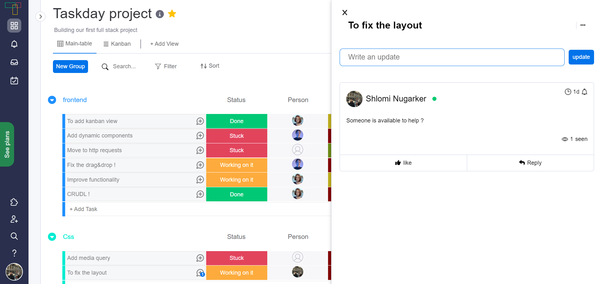
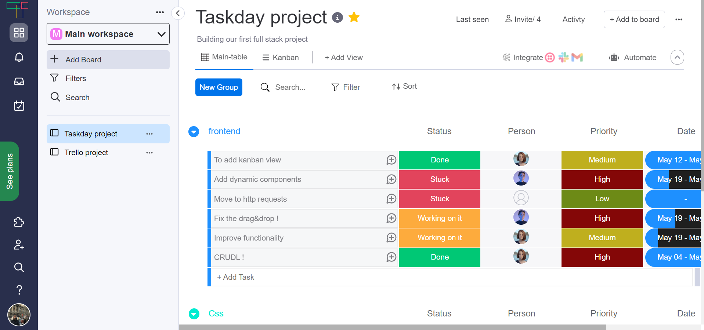
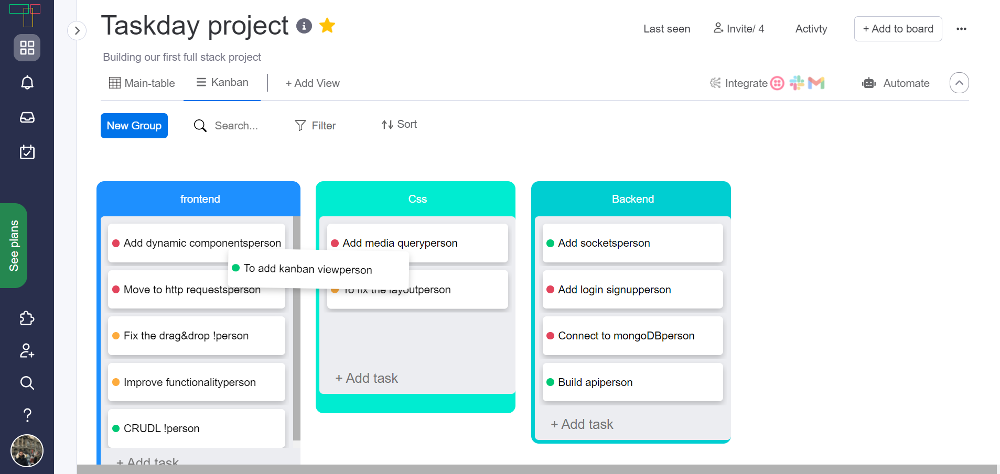

# Taskday - Modern Project Management Platform


Taskday is a sophisticated project management application inspired by Monday.com, built with Vue.js and modern web technologies. This platform enables teams to manage tasks efficiently with an intuitive interface and powerful features.

## 🚀 Features

- **Interactive Kanban Boards**: Drag-and-drop task management with customizable workflows
- **Real-time Collaboration**: Instant updates and team communication tools
- **Advanced Analytics**: Custom dashboards and performance metrics
- **Smart Scheduling**: Automated timeline management and deadline tracking
- **Seamless Integrations**: Connect with GitHub, Slack, Google Drive, and more
- **Enterprise-grade Security**: Role-based access control and data encryption

## 💻 Technology Stack

- **Frontend**: Vue.js, Vuex, Vue Router, TailwindCSS
- **Backend**: Node.js, Express
- **Database**: MongoDB
- **Authentication**: JWT, OAuth
- **Deployment**: Docker, AWS/Azure
- **Testing**: Jest, Cypress

## 📸 Screenshots

### Dashboard


### Task Management


### Project Overview


## 🛠️ Installation and Setup

```bash
# Clone the repository
git clone https://github.com/yourusername/taskday.git

# Navigate to project directory
cd taskday

# Install dependencies
npm install

# Start development server
npm run serve

# Build for production
npm run build

# Run tests
npm run test
```

## 🌐 Project Structure

```
taskday/
├── frontend/             # Vue.js frontend
│   ├── public/           # Static files
│   ├── src/              # Source files
│   │   ├── assets/       # Images, fonts, etc.
│   │   ├── components/   # Vue components
│   │   ├── router/       # Vue router
│   │   ├── store/        # Vuex store
│   │   ├── styles/       # CSS/SCSS styles
│   │   ├── utils/        # Utility functions
│   │   ├── views/        # Page components
│   │   ├── App.vue       # Root component
│   │   └── main.js       # Entry point
│   └── tests/            # Frontend tests
├── backend/              # Node.js backend
│   ├── config/           # Configuration files
│   ├── controllers/      # Request handlers
│   ├── models/           # Data models
│   ├── routes/           # API routes
│   ├── services/         # Business logic
│   ├── utils/            # Utility functions
│   └── server.js         # Server entry point
├── docker/               # Docker configuration
└── docs/                 # Documentation
```

## 🔒 Security Features

- HTTPS encryption for all data in transit
- JWT-based authentication with refresh tokens
- Role-based access control
- Input validation and sanitization
- Security headers and protection against common web vulnerabilities
- Regular security audits and dependency updates

## 🔄 CI/CD Pipeline

- Automated testing for frontend and backend
- Code quality checks with ESLint and Prettier
- Docker containerization for consistent deployment
- Continuous integration with GitHub Actions
- Automated deployment to staging and production environments

## 📝 Development Principles

- **Clean Code**: Following best practices and SOLID principles
- **Component-Based Architecture**: Reusable, modular components
- **Responsive Design**: Mobile-first approach for all screen sizes
- **Accessibility**: WCAG 2.1 compliant
- **Performance Optimization**: Lazy loading, code splitting, and efficient rendering

## 🌟 Key Technical Challenges Solved

1. **Real-time Synchronization**: Implemented WebSockets for live updates across clients
2. **Complex State Management**: Designed a robust Vuex store architecture with modules
3. **Drag-and-Drop Performance**: Optimized rendering for smooth user interactions
4. **Authentication Flow**: Created a secure, seamless login experience with JWT
5. **Data Visualization**: Built dynamic charts and reports with D3.js

## 📊 Future Enhancements

- AI-powered task prioritization
- Enhanced reporting and analytics
- Resource allocation optimization
- Native mobile applications
- Advanced automation workflows

## 👤 About the Developer

This project was designed and developed by Shlomi Assaf, a full-stack developer passionate about creating intuitive, high-performance web applications. With expertise in Vue.js, Node.js, and modern web technologies, I specialize in building scalable solutions for complex problems.

## 📫 Contact

- **Email**: shlomin1231@gmail.com
- **GitHub**: [github.com/shlomiassaf](https://github.com/shlomiassaf)
- **LinkedIn**: [linkedin.com/in/shlomiassaf](https://linkedin.com/in/shlomiassaf)
- **Portfolio**: [shlomiassaf.com](https://shlomiassaf.com)

## 📄 License

This project is licensed under the MIT License - see the [LICENSE](LICENSE) file for details.


